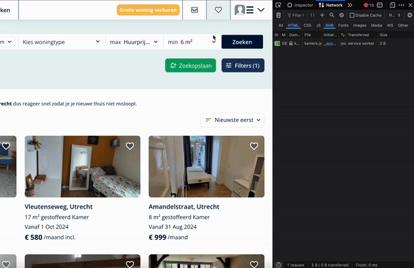

# Kamernet BotBot
**Stel je hebt grote fout gemaakt om toch €35 / maand te betalen aan Kamernet**, maar wil je niet elke uur van de dag zelf Kamernet afspeuren en reageren op nieuwe kamers die voor jou interessant kunnen zijn? Gebruik dan dit script. Het script zoekt automatisch naar nieuwe kamers en reageert direct voor je.

Gebruik dit script op eigen risico

## Installatie

1. Download deze folder naar een server of lokaal (is alleen lokaal getest). Hernoem de `.env.example` file naar `.env` en vul hier je credentials in.

    Het interval bepaalt hoe vaak Kamernet wordt gescand. Er is ook een kleine variatie toegevoegd, zodat het niet steeds precies hetzelfde moment is, wat de kans op detectie verkleint.

    > Zet in eerste instantie developer modus aan!  
2. Ga naar Kamernet.nl, open meteen de ontwikkelaarstools en ga naar het tabblad "Network". Stel vervolgens al je filters in, zoals prijs, locatie, afstand, beschikbaarheid, of geslacht. Wanneer je de filters toepast, wordt er een POST-verzoek gedaan naar de file `findlistings`. Open dit verzoek, zet de JSON-weergave naar raw, kopieer de inhoud en plak deze in de `searchQuery.js` file.

3. Stel nu je bericht in via `/app/MessageRooms.js`. In de functie `Message` kun je met if- en else-statements verschillende berichten instellen voor diverse verhuurders, afhankelijk van het aantal huisgenoten of het type kamer.
4. Nu alles goed is ingesteld run in de terminal `npm i` voor de eerste run en dan `npm run start`. 
5. Zodra alles er goed uitziet ga terug naar de `.env` file en zet `DEV_MODE` op false

Veel succes met het vinden van een kamer<3